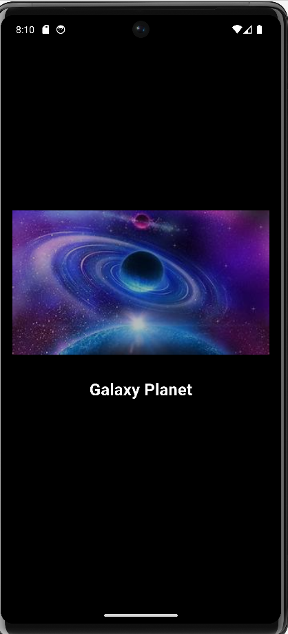
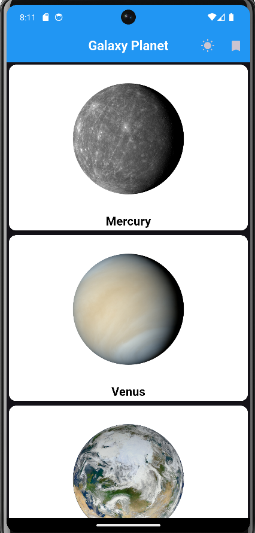
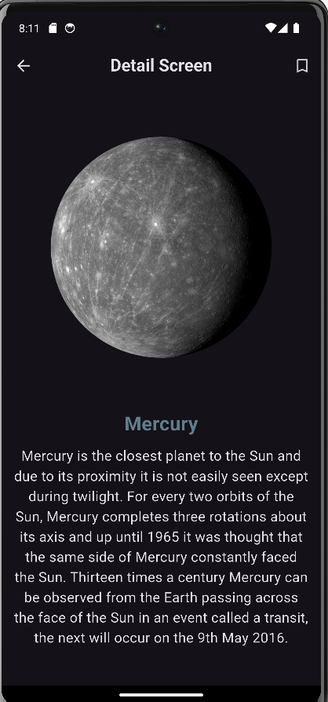
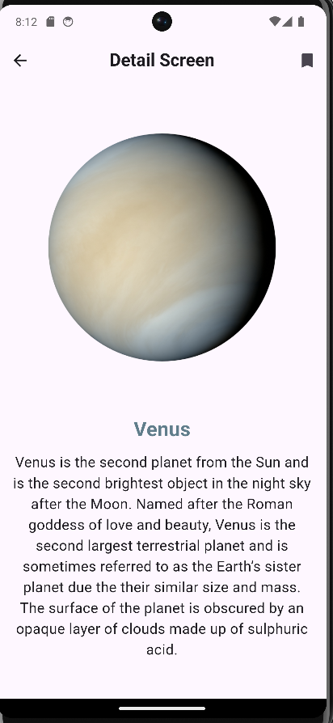
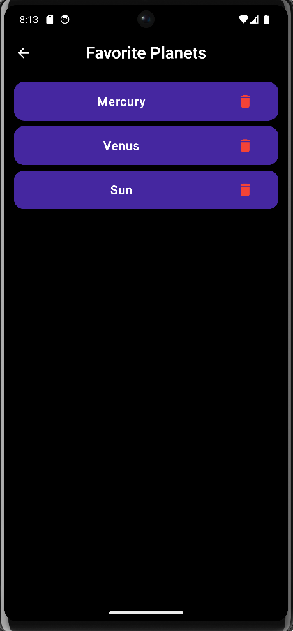

🌌 Galaxy Planets (Animator)

💡 Overview

"Galaxy Planets (Animator)" is an exciting mobile application built using Flutter, focusing on creating captivating animations. The app incorporates concepts such as Implicit Animation and Explicit Animation, along with additional features like Shared Preferences and a Local JSON Bank. It offers a range of functionalities designed to provide users with an immersive and visually stunning experience.

✨ Features

🌍 Implicit & Explicit Animations: Smooth and engaging animations to enhance user experience.

💍 Planet Details Fetching: Displays detailed information about various planets.

⭐ Favorites: Users can save their favorite planets for quick access.

🌟 Light & Dark Themes: Toggle between light and dark modes for a customized visual experience.

🔐 Shared Preferences: Saves user preferences and settings.

📂 Local JSON Bank: Uses a locally stored JSON file for retrieving planet details.

🎨 Splash Screen: A visually appealing splash screen on app launch.

🌕 Detailed Planet Screens: Provides in-depth information and animations for each planet.

⚛️ Technologies Used

💻 Flutter: Cross-platform mobile development framework.

📈 Dart: Programming language for Flutter.

🛠 Provider: State management solution.

🛡 Shared Preferences: Persistent storage for user preferences.

🎭 Custom Animations: Implicit and explicit animations for an engaging UI.

📑 JSON Parsing: Handling local JSON data for planet details.

🔄 Installation

Clone the repository:

git clone https://github.com/yourusername/galaxy-planets-animator.git

Navigate to the project directory:

cd galaxy-planets-animator

Install dependencies:

flutter pub get

Run the application:

flutter run

🖼 Screenshots

👨‍👩‍👦 Contribution

Contributions are welcome! Follow these steps:

Fork the repository.

Create a new branch (feature-branch).

Commit your changes.

Push to the branch.

Open a pull request.
